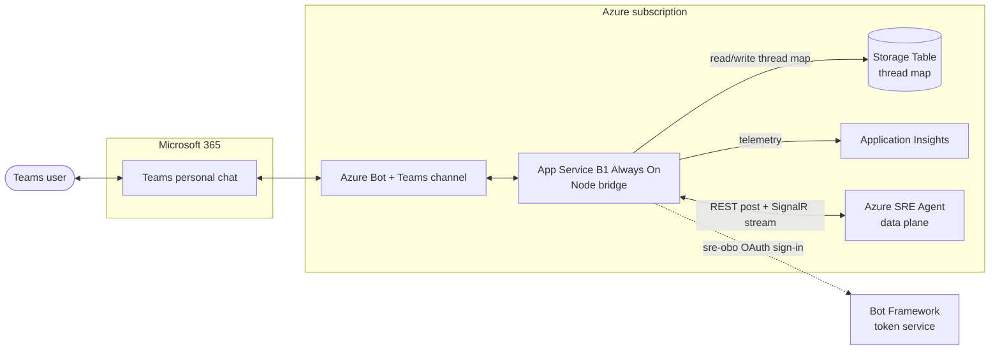

# SRE Agent Teams Bot

A Microsoft Teams personal-chat bot that bridges users to the Azure SRE Agent
data plane. Messages flow both ways, the agent's streaming narrative is rendered
as Adaptive Cards, and write commands are approved in chat and executed under the
signed-in user's identity through on-behalf-of (OBO) token exchange.



Read commands stream straight back as Adaptive Cards. Write commands surface an
approval card and then execute as the signed-in user via two-phase OBO (see
[docs/ARCHITECTURE.md](docs/ARCHITECTURE.md) for the sequence diagrams).

## What you get

- One continuous SRE Agent thread per Teams user, mapped in Azure Table Storage.
- Streaming responses, progress, and final answer rendered as Adaptive Cards.
- Two-phase OBO so approved write commands run with the user's permissions, never a standing service role.
- Full IaC: Bicep and Terraform stand up everything on an empty tenant.

See [docs/AUTH.md](docs/AUTH.md) for the auth and OBO model.

## Prerequisites

An SRE Agent must already exist (the bridge connects to it, it does not create
it). Full list in [PREREQUISITES.md](PREREQUISITES.md). You also need: an Azure
subscription, the `az` CLI, Node 20, and either Bicep or Terraform.

## Quickstart

1. **Bot identity (bootstrap, phase 1)**

   ```powershell
   ./scripts/bootstrap.ps1 -Phase appreg -DisplayName "SRE Agent Teams Bridge"
   ```

   Note the `BOT_APP_ID` and `BOT_APP_SECRET` it prints.

2. **Deploy infrastructure** with Bicep:

   ```powershell
   az group create -n rg-sre-agent-teams-bridge -l centralus
   az deployment group create -g rg-sre-agent-teams-bridge -f infra/main.bicep `
     -p appName=<unique-name> botMicrosoftAppId=<BOT_APP_ID> `
        botMicrosoftAppPassword=<BOT_APP_SECRET> `
        sreAgentEndpoint=https://<your-agent>.<region>.azuresre.ai
   ```

   or Terraform (copy `infra/terraform/terraform.tfvars.example` to
   `terraform.tfvars`, fill it in):

   ```powershell
   cd infra/terraform; terraform init; terraform apply
   ```

3. **OAuth connection (bootstrap, phase 2)** once the bot exists:

   ```powershell
   ./scripts/bootstrap.ps1 -Phase oauth -ResourceGroup rg-sre-agent-teams-bridge `
     -BotName <unique-name> -BotAppId <BOT_APP_ID> -BotAppSecret <BOT_APP_SECRET>
   ```

4. **Grant the bridge access to the agent.** Assign `SRE Agent Standard User`
   on the SRE Agent resource to the App Service managed identity (the Terraform
   stack does this when `sre_agent_resource_id` is set; Bicep leaves it to this step).

5. **Deploy app code**, then **upload the Teams package** built from
   `appPackage/manifest.template.json` (replace `${...}` tokens) plus
   `color.png` and `outline.png` via Teams > Apps > Manage your apps > Upload.

## Configuration

Copy `.env.example` to `.env` for local runs; in Azure these are app settings.

| Setting | Purpose |
| --- | --- |
| `MicrosoftAppId` / `MicrosoftAppPassword` | Bot Entra app id + secret |
| `MicrosoftAppType` / `MicrosoftAppTenantId` | `SingleTenant` + tenant id |
| `SRE_AGENT_ENDPOINT` | SRE Agent data-plane base URL |
| `SRE_AGENT_SCOPE` | Token scope, default `https://azuresre.dev/.default` |
| `THREAD_TABLE_ENDPOINT` / `THREAD_TABLE_NAME` | Table mapping store |
| `SRE_OAUTH_CONNECTION_NAME` | Bot OAuth connection, default `sre-obo` |
| `APPLICATIONINSIGHTS_CONNECTION_STRING` | Telemetry |

## Local commands

```powershell
npm install
npm run build
npm test
```

## Repository layout

- `src/` bridge (bot logic, SRE client, streaming, thread store)
- `infra/main.bicep`, `infra/terraform/` two IaC stacks
- `scripts/bootstrap.ps1` Entra app-reg + OAuth connection
- `appPackage/manifest.template.json` Teams manifest template
- `docs/` architecture and auth design

## Disclaimer

This project is an independent, community sample provided **"as is"**, without
warranty of any kind (see [LICENSE](LICENSE)). It is **not supported software**:
there is no SLA, and no commitment to maintenance, updates, or issue response.

It is **not affiliated with, endorsed by, or a product of Microsoft**. "Azure",
"Microsoft Teams", "Azure SRE Agent", and "Bot Framework" are trademarks of
Microsoft, used here for identification only.

Deploying this project **creates billable Azure resources** and **grants a bot
the ability to execute control-plane actions** (including write operations such
as deallocating or modifying resources) against your tenant. **You are solely
responsible** for reviewing the code, the permissions you grant, the resources
it deploys, the costs incurred, and any actions it performs. **Use at your own
risk.**

## License

Released under the [MIT License](LICENSE).
