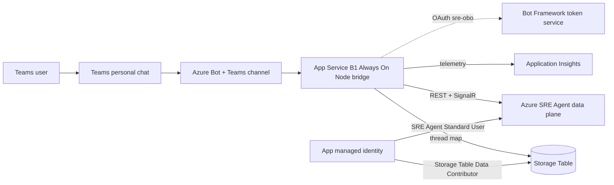
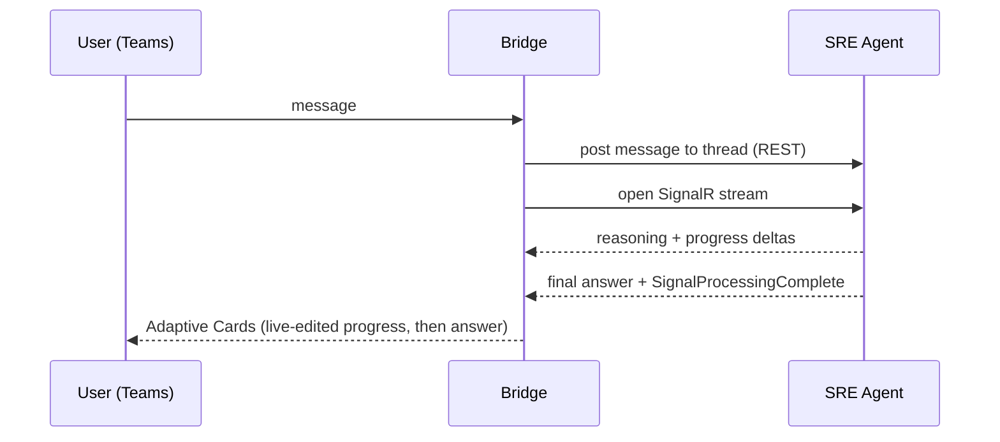
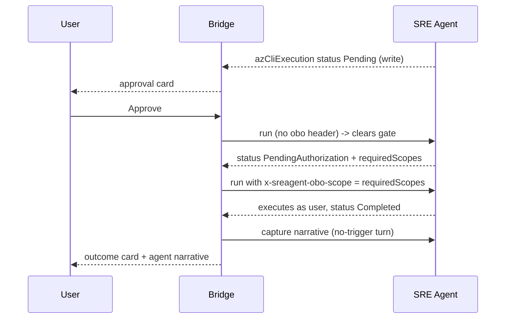

# Architecture

## Components

The bridge is stateless except for the Teams-conversation to SRE-thread map kept
in Table Storage, so each user keeps one continuous agent thread. The bridge
identity is a system-assigned managed identity: no secrets to rotate for Azure
data access. Bot-to-channel auth uses the single-tenant Entra app id + secret.

## Message flow

## Two-phase OBO approval

Read commands run directly. Write commands are gated; the bridge surfaces an
approval card, then runs the command as the user via two REST runs.

## Design decisions

Non-obvious choices where a viable alternative was rejected, and why.

- **SRE Agent is a parameter, not provisioned.** Alternative: provision it in IaC. Rejected because creating an agent needs RBAC-admin rights on the target sub and is a one-time act, while the bridge is redeployable; coupling them would force every bridge deploy to hold elevated rights.
- **B1 + Always On, not Free tier.** Alternative: F1 Free. Rejected because Free idle-unloads the container and the first Teams message after a cold start is dropped (no `/api/messages` handler loaded yet), and the F1 daily CPU quota stops the app outright.
- **Storage public network Enabled + managed-identity (key-less).** Alternative: private endpoint / VNet, or shared-key access. Rejected: no VNet is provisioned, so with public access off the MI table reads return 403 AuthorizationFailure; shared keys would reintroduce a secret to rotate.
- **Interactive sign-in, not Teams SSO.** Alternative: SSO token exchange. Rejected because an SSO-exchanged token cannot be re-exchanged for OBO, so write commands stall at PendingAuthorization; an auth-code (interactive) token can be re-exchanged. See AUTH.md.
- **Render replies as Adaptive Cards, not plain text.** Alternative: post the agent text as-is. Rejected because plain Teams text drops content the SRE portal shows: the agent's post-action narrative, the command title, who approved it (OBO attribution), and start/complete timestamps. Cards recover those, so Teams matches the portal instead of losing detail. Cards target schema 1.4; 1.5 Badge renders unreliably in Teams, so risk is shown as text, not a badge.
- **One SRE thread per Teams user.** Alternative: a new thread per message. Rejected because the agent keeps context within a thread; a fresh thread per message loses prior turns. The user-to-thread map lives in Table Storage.
- **No standing write role on the bridge.** Alternative: grant the bridge identity a write role and skip OBO. Rejected because it breaks least-privilege and attribution: writes must run as the approving user, so if the user lacks access the action is denied. The bridge holds only Standard User.
