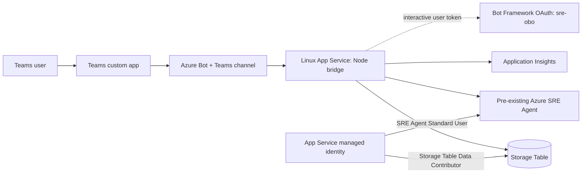
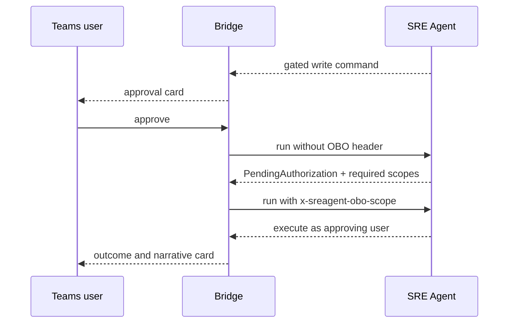

# Architecture

```mermaid
flowchart LR
  user[Teams user] --> teams[Teams custom app]
  teams --> bot[Azure Bot + Teams channel]
  bot --> app[Linux App Service: Node bridge]
  app --> table[(Storage Table)]
  app --> insights[Application Insights]
  app --> sre[Pre-existing Azure SRE Agent]
  app -. interactive user token .-> token[Bot Framework OAuth: sre-obo]
  mi[App Service managed identity] -->|Storage Table Data Contributor| table
  mi -->|SRE Agent Standard User| sre
```

The bridge is deployed into a selected subscription; it does not provision the
SRE Agent. The existing SRE Agent can be in another subscription in the same
Entra tenant. The App Service managed identity is granted access to its exact
agent resource, so a cross-tenant SRE Agent is unsupported.

The bridge persists the Teams-user-to-SRE-thread mapping in `TeamsSreThreads`.
It uses its managed identity and `https://azuresre.dev/.default` for normal
SRE-Agent and storage access. Bot Framework authentication uses the separate
single-tenant bot application and client secret.

## Write approval flow

```mermaid
sequenceDiagram
  participant U as Teams user
  participant B as Bridge
  participant S as SRE Agent
  S-->>B: gated write command
  B-->>U: approval card
  U->>B: approve
  B->>S: run without OBO header
  S-->>B: PendingAuthorization + required scopes
  B->>S: run with x-sreagent-obo-scope
  S-->>B: execute as approving user
  B-->>U: outcome and narrative card
```

The interactive `sre-obo` connection requests delegated
`Threads.ReadWrite.All`; it is not the managed identity `.default` scope. This
keeps approved writes attributable to the user rather than granting the bridge a
standing write role. See [AUTH.md](AUTH.md).

## Deployment shape

Bicep and Terraform both create the App Service, Bot/Teams channel, Storage,
Application Insights, and role assignments. The deployment script uploads only
tracked TypeScript source and build metadata. App Service Oryx performs the
Linux dependency installation and TypeScript build remotely; local `dist/`,
`node_modules/`, and WSL are not deployment prerequisites.
